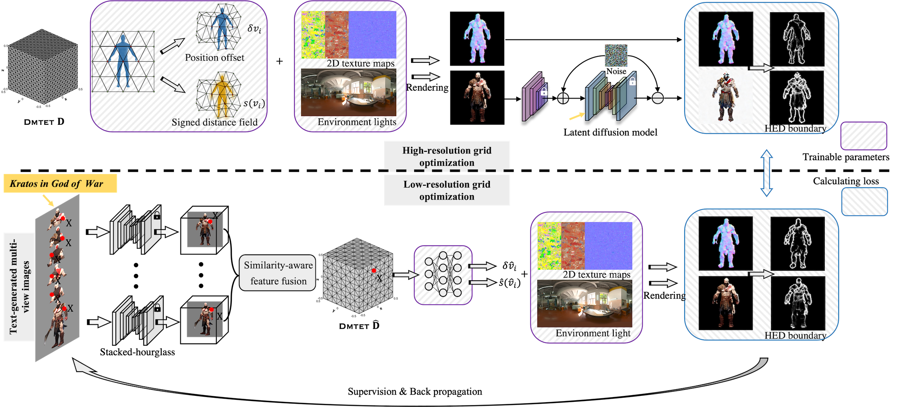

<div align="center">

# Guide3D: Create 3D Avatars from Text and Image Guidance
  
<a href="https://yukangcao.github.io/">Yukang Cao</a>,
<a href="https://yanpei.me/">Yan-Pei Cao</a>,
<a href="https://www.kaihan.org/">Kai Han</a>,
<a href="https://scholar.google.com/citations?user=4oXBp9UAAAAJ&hl=en&oi=ao">Ying Shan</a>,
<a href="https://i.cs.hku.hk/~kykwong/">Kwan-Yee K. Wong</a>


[](https://arxiv.org/abs/2308.09705)


  
Please refer to our webpage for more visualizations.
</div>

## Abstract
Recently, text-to-image generation has exhibited remarkable advancements, with the ability to produce visually impressive results. In contrast, text-to-3D generation has not yet reached a comparable level of quality. Existing methods primarily rely on text-guided score distillation sampling (SDS), and they encounter difficulties in transferring 2D attributes of the generated images to 3D content. In this work, we aim to develop an effective 3D generative model capable of synthesizing high-resolution textured meshes by leveraging both textual and image information. To this end, we introduce Guide3D, a zero-shot text-and-image-guided generative model for 3D avatar generation based on diffusion models. Our model involves (1) generating sparse-view images of a text-consistent character using diffusion models, and (2) jointly optimizing multi-resolution differentiable marching tetrahedral grids with pixel-aligned image features. We further propose a similarity-aware feature fusion strategy for efficiently integrating features from different views. Moreover, we introduce two novel training objectives as an alternative to calculating SDS, significantly enhancing the optimization process. We thoroughly evaluate the performance and components of our framework, which outperforms the current state-of-the-art in producing topologically and structurally correct geometry and high-resolution textures. Guide3D enables the direct transfer of 2D-generated images to the 3D space. Our code will be made publicly available.
<!-- 
## Pipeline
We craft high-resolution 3D head avatars in a coarse-to-fine manner. At the core of our network are: **(a) prior-driven score distillation** empowered by a landmark-based ControlNet as well as a view-dependent textual inversion. **(b) identity-aware editing score distillation** which maintains a controlled editing direction that respects both the original identity and the editing instruction.
 -->


## Code
Stay tuned! We are working on releasing the code... 🏗️ 🚧 🔨

## Misc.
If you want to cite our work, please use the following bib entry:
```
@article{cao2023guide3d,
  title={Guide3D: Create 3D Avatars from Text and Image Guidance},
  author={Cao, Yukang and Cao, Yan-Pei and Han, Kai and Shan, Ying and Wong, Kwan-Yee K},
  journal={arXiv preprint arXiv:2308.09705},
  year={2023}
}
```
